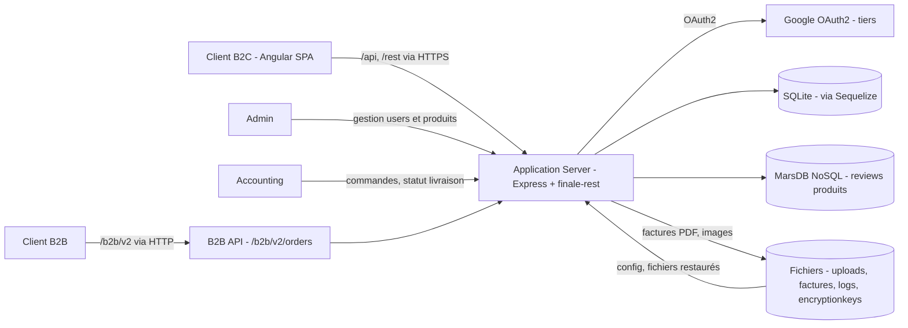

# Threat model STRIDE - fork Juice Shop

> Analyse réalisée sur le fork Juice Shop utilisé pendant le module. Juice Shop est volontairement vulnérable : les exigences ci-dessous décrivent les protections attendues pour une application de commerce électronique réelle.

## 1. Contexte et biens essentiels

| Bien essentiel | Pourquoi il compte | Événement redouté (EBIOS) | Gravité (1 à 4) |
|---|---|---|---|
| BE1 - Comptes et données personnelles des clients | Ils permettent l'identification et la relation commerciale ; leur confidentialité est une obligation réglementaire. | ER1 - Divulgation des comptes et données personnelles, entraînant usurpation d'identité, préjudice RGPD et perte de confiance. | 4 |
| BE2 - Commandes, paniers et historique d'achat | Ils constituent les transactions commerciales et servent de preuve en cas de litige. | ER2 - Altération ou divulgation des commandes, entraînant fraude, pertes financières et litiges. | 4 |
| BE3 - Moyens et données de paiement | Ils sont nécessaires à l'encaissement et leur compromission expose les clients et le commerçant à la fraude. | ER2 - Altération ou divulgation des paiements et commandes, entraînant fraude, pertes financières et litiges. | 4 |
| BE4 - Catalogue et avis produits | Ils soutiennent les ventes et l'image de marque de la boutique. | ER3 - Indisponibilité de la boutique ou altération du catalogue et des avis, perturbant les ventes et dégradant l'image. | 3 |

## 2. Data flow diagram

### Trust boundaries identifiées

- **TB1 - Navigateurs et serveur applicatif** : les paramètres, identifiants, en-têtes, cookies, fichiers et jetons provenant d'un client doivent être considérés comme hostiles.
- **TB2 - Serveur applicatif et zone de stockage** : Express accède à SQLite, MarsDB et au système de fichiers ; les entrées doivent être validées et les accès limités.
- **TB3 - Zone publique et back-office** : les routes utilisent le même processus Express, mais les rôles client, administrateur et comptabilité doivent être séparés par des contrôles d'autorisation.
- **TB4 - Serveur applicatif et Google OAuth2** : le fournisseur d'identité est hors du périmètre maîtrisé ; les réponses OAuth2, redirections et jetons doivent être validés.

## 3. Analyse STRIDE

| # | Élément / flux | Catégorie STRIDE | Menace concrète | Exigence de sécurité | Priorité (H/M/L) |
|---|---|---|---|---|---|
| T1 | TB1 - `GET /rest/basket/:id` | Tampering | Un client authentifié remplace l'identifiant dans l'URL et consulte le panier d'un autre client, car la recherche porte sur `id` sans vérifier son appartenance à l'utilisateur. | Vérifier côté serveur que chaque panier demandé appartient à l'identité du JWT ; refuser sinon avec un code 403. | H |
| T2 | TB1 - création ou modification du catalogue | Tampering | Une route produit protégée uniquement par une authentification peut permettre à un simple client d'ajouter ou d'altérer des informations du catalogue. | Réserver toute écriture sur le catalogue au rôle administrateur et tester les autorisations par rôle. | H |
| S1 | TB1 - authentification JWT | Spoofing | La clé privée RSA utilisée pour signer les JWT est codée en dur dans `lib/insecurity.ts` ; sa récupération permet de forger une identité ou un rôle. | Générer une clé propre à chaque environnement, la conserver dans un gestionnaire de secrets, prévoir rotation et révocation, et ne jamais la versionner. | H |
| S2 | TB1 - cookies signés | Spoofing | Le secret fixe `kekse` de `cookie-parser` dans `server.ts` permettrait de fabriquer des cookies signés si ceux-ci protègent un état sensible. | Charger un secret aléatoire depuis un gestionnaire de secrets, le renouveler et configurer les attributs `Secure`, `HttpOnly` et `SameSite`. | M |
| R1 | TB3 - actions d'administration et de comptabilité | Repudiation | Les journaux d'accès HTTP ne constituent pas une piste d'audit métier suffisante : un acteur privilégié peut nier une modification de produit ou de statut de livraison. | Journaliser de manière horodatée l'identité, l'action, la ressource et le résultat des opérations sensibles, avec intégrité et durée de conservation définies. | M |
| I1 | TB2 - table SQLite `Users` | Information disclosure | Les mots de passe sont transformés avec MD5 sans mécanisme lent ni sel individuel ; après extraction, les empreintes peuvent être cassées rapidement. | Stocker les mots de passe avec Argon2id ou bcrypt, un sel unique et des paramètres de coût adaptés ; migrer les anciennes empreintes. | H |
| I2 | TB1/TB2 - `/ftp`, `/support/logs` et `/encryptionkeys` | Information disclosure | `serve-index` révèle les noms de fichiers et permet de découvrir des journaux, documents ou clés accessibles depuis la zone publique. | Supprimer le listing, placer ces fichiers hors de la racine servie et appliquer une autorisation explicite aux téléchargements nécessaires. | M |
| I3 | TB1 - réponse `/metrics` et en-têtes HTTP | Information disclosure | L'endpoint Prometheus est exposé avant le catch-all Angular ; CORS accepte toutes les origines et la protection Helmet est partielle, ce qui facilite la collecte d'informations techniques. | Restreindre `/metrics` au réseau de supervision, définir une liste CORS autorisée et activer une politique d'en-têtes complète, notamment CSP. | M |
| D1 | TB1 - `/rest/user/reset-password` | Denial of service | La clé du rate-limit fait confiance à l'en-tête falsifiable `X-Forwarded-For` ; un attaquant peut changer cette valeur et contourner la limitation pour multiplier les requêtes. | Ne faire confiance qu'aux proxys déclarés, utiliser l'adresse normalisée par Express et ajouter des limites par compte ainsi qu'une surveillance des abus. | M |
| D2 | TB1 - `/b2b/v2/orders` | Denial of service | Le serveur évalue `orderLinesData` et peut consacrer jusqu'à deux secondes à chaque requête ; des appels parallèles peuvent monopoliser les ressources et interrompre les ventes. | Ne pas évaluer de code fourni par le client ; valider un schéma de données strict et ajouter limites de taille, débit, concurrence et temps de traitement. | H |
| E1 | TB1/TB3 - `POST /api/Users` | Elevation of privilege | Le modèle accepte le champ `role` fourni lors de la création d'un utilisateur ; un client peut tenter de s'inscrire avec le rôle `admin` ou `accounting`. | Ignorer tout rôle fourni à l'inscription publique, imposer `customer` côté serveur et réserver les changements de rôle à une fonction administrative contrôlée. | H |
| E2 | TB3 - middleware `isAuthorized()` | Elevation of privilege | `isAuthorized()` vérifie la validité du JWT mais pas le rôle ; son utilisation seule sur une route sensible accorde la même autorisation à tout utilisateur authentifié. | Appliquer un contrôle d'accès centralisé par rôle et par ressource, avec refus par défaut et tests négatifs pour chaque route sensible. | H |

La priorité est déterminée qualitativement par l'impact sur les biens essentiels, l'exploitabilité et l'exposition du composant. Une priorité H correspond ici à une atteinte directe aux comptes, aux commandes, aux paiements ou à la disponibilité des ventes depuis une surface exposée.

## 4. Correspondance avec EBIOS RM

| Menace STRIDE (ligne) | Événement redouté associé | Scénario de risque (source -> chemin -> impact) |
|---|---|---|
| T1 - accès à un panier par son identifiant | ER2 - Altération ou divulgation des commandes et paiements | Client malveillant -> modification de l'identifiant de `/rest/basket/:id` -> consultation ou manipulation du panier d'un tiers -> litige, fraude et perte de confiance. |
| T2 - écriture non autorisée sur le catalogue | ER3 - Altération du catalogue et perturbation des ventes | Client authentifié malveillant -> appel d'une route produit sans contrôle du rôle -> ajout ou altération du catalogue -> clients trompés, ventes perturbées et atteinte à l'image. |
| S1 - forge de JWT avec la clé privée codée en dur | ER1 et ER2 - Divulgation des comptes, commandes ou paiements | Cybercriminel externe -> récupération de la clé versionnée -> création d'un JWT avec une identité ou un rôle privilégié -> accès aux données clients et réalisation d'opérations frauduleuses. |
| I1 - mots de passe stockés avec MD5 | ER1 - Divulgation des comptes et données personnelles | Cybercriminel externe -> extraction de la table `Users` par une vulnérabilité exposée -> cassage rapide des empreintes MD5 -> prise de contrôle de comptes, préjudice RGPD et perte de confiance. |
| D2 - saturation du traitement B2B | ER3 - Indisponibilité de la boutique | Acteur externe disposant d'un compte -> envoi parallèle de charges coûteuses à `/b2b/v2/orders` -> saturation du processus Express -> interruption des ventes et perte de chiffre d'affaires. |
| E1 - choix d'un rôle privilégié à l'inscription | ER1 et ER2 - Divulgation ou altération des données sensibles | Client malveillant -> envoi du champ `role=admin` ou `role=accounting` à `/api/Users` -> obtention de privilèges -> accès aux comptes, commandes ou fonctions sensibles. |
| E2 - autorisation sans contrôle du rôle | ER2 et ER3 - Altération des transactions ou du catalogue | Utilisateur authentifié -> appel d'une route sensible protégée uniquement par `isAuthorized()` -> exécution d'une action réservée -> fraude, litige ou perturbation des ventes. |

## 5. Suivi

Chaque exigence de priorité H sera reliée à un contrôle ultérieur du module :

- **T1 - appartenance des paniers** : tests d'intégration d'autorisation et finding DAST vérifiant qu'un utilisateur reçoit `403` pour le panier d'un tiers.
- **T2 - écriture du catalogue** : tests d'intégration par rôle et finding d'audit sur les routes d'administration.
- **S1 - gestion de la clé JWT** : détection de secrets dans la CI, revue SAST et vérification du stockage des secrets lors de l'audit.
- **I1 - stockage des mots de passe** : règle SAST recherchant MD5 et finding d'audit sur le modèle `User`.
- **D2 - protection de l'API B2B** : tests de limites de taille et de débit, puis scénario DAST de résistance aux charges coûteuses.
- **E1 - rôle à l'inscription** : test API imposant le rôle `customer`, même lorsque le corps contient un autre rôle.
- **E2 - contrôle d'accès par rôle** : matrice de tests d'autorisation en CI et revue manuelle des middlewares de chaque route sensible.
